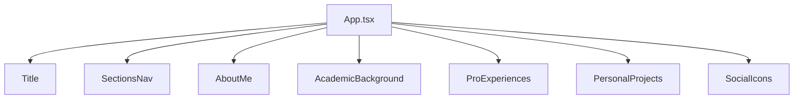
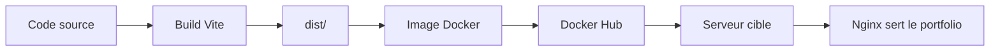
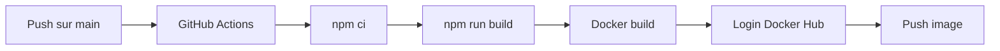

# Documentation technique — Portfolio

## 1. Vue d'ensemble

Ce projet est un portfolio frontend développé en **React + TypeScript** et bundlé avec **Vite**.
L'application est ensuite servie en production par **Nginx** dans une image **Docker**.

Objectif technique : proposer une application web statique, légère, rapide à builder et simple à déployer.

---

## 2. Technologies utilisées

### Frontend
- **React 19** : construction de l'interface en composants.
- **TypeScript 5** : typage statique et meilleure maintenabilité.
- **Vite 7** : serveur de développement rapide et build de production.
- **Tailwind CSS 4** : styles utilitaires.
- **React Icons** : icônes sociales et visuelles.

### Qualité et outillage
- **ESLint 9** : contrôle qualité du code.
- **npm** : gestion des dépendances et scripts.

### Livraison et hébergement
- **Docker** : conteneurisation de l'application.
- **Nginx** : service des fichiers statiques et fallback SPA.
- **GitHub Actions** : pipeline CI/CD.
- **Docker Hub** : registry des images Docker.

---

## 3. Architecture applicative

Le projet suit une structure simple orientée composants :

- `src/App.tsx` : composition principale de la page.
- `src/title/` : bloc d'identité et présentation.
- `src/sectionsNav/` : navigation interne entre sections.
- `src/aboutMe/` : section de présentation.
- `src/academicBackground/` : parcours académique.
- `src/proExperiences/` : expériences professionnelles.
- `src/personalProjects/` : projets personnels.
- `src/socialIcons/` : liens externes et réseaux.

### Diagramme simplifié des composants



---

## 4. Cycle de build et d'exécution

### En local
- `npm run dev` : lance le serveur Vite.
- `npm run build` : compile TypeScript puis génère le dossier `dist/`.
- `npm run lint` : vérifie la qualité du code.
- `npm run preview` : prévisualise le build localement.

### En production
Le build produit des fichiers statiques dans `dist/`, ensuite servis par Nginx.

---

## 5. Conteneurisation Docker

Le projet utilise un **build multi-stage** :

1. **Stage build** : image `node:18-alpine`
   - installation des dépendances via `npm ci`
   - exécution de `npm run build`
2. **Stage runtime** : image `nginx:alpine`
   - copie du contenu de `dist/`
   - configuration Nginx personnalisée
   - exposition du port `80`

### Rôle de Nginx
La configuration inclut un fallback SPA :

- `try_files $uri $uri/ /index.html;`

Cela permet aux routes frontend de fonctionner correctement après rafraîchissement navigateur.

### Diagramme de déploiement



---

## 6. Pipeline CI/CD

Le pipeline est défini dans **GitHub Actions** et s'exécute sur un `push` vers la branche `main`.

### Étapes principales
1. Récupération du code source.
2. Initialisation de **Node.js 18**.
3. Installation des dépendances avec `npm ci`.
4. Build de l'application avec `npm run build`.
5. Authentification à Docker Hub.
6. Build de l'image Docker.
7. Push de l'image sur Docker Hub.

### Secrets requis
- `DOCKERHUB_USERNAME`
- `DOCKERHUB_TOKEN`

### Tags publiés
- `hamzaportfolio:latest`
- `hamzaportfolio:<sha-du-commit>`

### Diagramme du pipeline



---

## 7. Déploiement sur Docker Hub

L'image générée est publiée sur Docker Hub afin d'être réutilisable sur n'importe quel environnement compatible Docker.

### Exemple de build manuel
```bash
docker build -t <dockerhub_user>/hamzaportfolio:latest .
```

### Exemple de publication manuelle
```bash
docker push <dockerhub_user>/hamzaportfolio:latest
```

### Exemple de lancement
```bash
docker run -d -p 8080:80 <dockerhub_user>/hamzaportfolio:latest
```

L'application est alors accessible sur :

- `http://localhost:8080`

---

## 8. Résumé technique

Ce portfolio repose sur une stack moderne et simple :

- **React + TypeScript + Vite** pour le frontend
- **Tailwind CSS** pour le style
- **Docker + Nginx** pour la livraison
- **GitHub Actions + Docker Hub** pour l'automatisation CI/CD

L'ensemble permet un projet :

- rapide à développer,
- facile à maintenir,
- simple à déployer,
- cohérent pour une mise en production continue.
